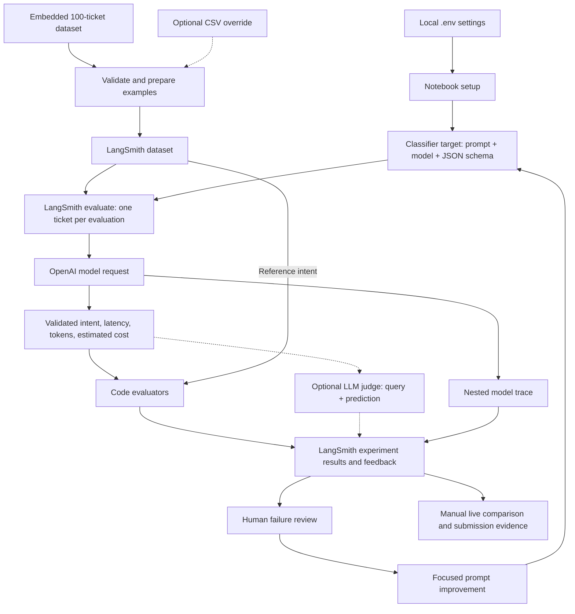
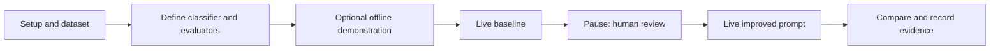

# Customer Support Intent Evaluation with LangSmith

A standalone Jupyter notebook for evaluating an e-commerce support intent classifier. It compares a baseline prompt with an improved prompt, records live experiments in LangSmith, and supports human failure analysis.

**Start here:** [Evaluations_Using_LangSmith_Customer_Support.ipynb](Evaluations_Using_LangSmith_Customer_Support.ipynb). All dataset, classifier, evaluator, and reporting code lives in this notebook. No separate Python scripts or application server are required.

## Project structure

For a spoken walkthrough with cell-by-cell execution cues and a short results-video script, use the [Demo Script](DEMO_SCRIPT.md).


```text
Evaluation_Project/
├── Evaluations_Using_LangSmith_Customer_Support.ipynb  # Main execution entry point
├── .env                                             # Local credentials; ignored by Git
├── .env.example                                     # Configuration template; safe to commit
├── .gitignore                                       # Excludes secrets and local artifacts
├── README.md                                        # Architecture and execution guide
└── Documentations/                                  # Reference handouts
    ├── Evaluations Using LangSmith.pdf
    └── Week 4 Project Handout (Aug 2026).pdf
```

The notebook includes the 100-ticket dataset. A separate CSV is optional. Any remaining empty directory from the earlier structured project is unused.

## Architecture

The notebook coordinates local Python code and two external services: OpenAI runs the classifier, and LangSmith stores evaluation datasets, traces, and feedback.



### Responsibilities inside the notebook

| Component | Main implementation | Responsibility |
|---|---|---|
| Configuration | `load_notebook_env()` | Loads `.env` beside the notebook and applies model/project settings |
| Dataset | `cases_by_intent`, `dataset_df` | Builds the embedded examples or reads an optional CSV |
| Prompt definitions | `BASELINE_PROMPT`, `IMPROVED_PROMPT` | Defines baseline routing and added precedence/negation rules |
| Live classifier | `build_live_target()` | Calls OpenAI at temperature zero, requests strict JSON output, and validates the intent |
| Code evaluation | `intent_exact_match`, `schema_valid`, `latency_sla` | Scores prediction correctness, allowed label membership, and latency |
| Dataset storage | `get_or_create_langsmith_dataset()` | Creates a LangSmith dataset or reuses one after checking example count |
| Experiment execution | `evaluate()` calls in section 9 | Runs baseline and improved targets with tracing and feedback |
| Optional judge | `build_reference_free_judge()` | Scores query/prediction pairs without seeing reference labels |
| Offline demonstration | `offline_target()`, `run_local_experiment()` | Exercises analysis with deterministic keyword rules |
| Reporting | Sections 10–13 | Guides human review, measured comparison, and submission |

### Data contract

The embedded dataset has 100 cases: 20 per intent, with 50 happy-path, 30 edge, 15 known-failure, and 5 adversarial cases.

| Field | Role |
|---|---|
| `id` | Stable ticket identifier |
| `query` | Customer ticket; sent as the classifier input |
| `intent` | Reference label used by Exact Match |
| `scenario_type`, `difficulty`, `source` | Coverage and provenance metadata |

Allowed intents are `order_status`, `refund_request`, `product_issue`, `account_help`, and `other`.

In LangSmith, each example maps `query` to inputs, `intent` to reference outputs, and the remaining fields to metadata. The classifier receives the query, not the reference label.

## Setup

1. Open the folder containing the notebook in VS Code with the Python and Jupyter extensions, or use an existing Jupyter installation.
2. Select a Python kernel. The local workflow was checked with Python 3.13.7; select an interpreter with the required packages installed.
3. If packages are missing, run the following in a notebook code cell, then restart the kernel:

```python
%pip install "langsmith>=0.3.13" "openai>=1.40" pandas numpy matplotlib seaborn scikit-learn python-dotenv pydantic
```

Using `%pip` installs into the active notebook environment. The notebook also contains a commented installation cell with these dependencies. Dependency versions are not locked.

4. Create `.env` beside the notebook. In PowerShell, this preserves an existing settings file:

```powershell
if (-not (Test-Path -LiteralPath .env)) {
    Copy-Item -LiteralPath .env.example -Destination .env
}
```

5. Edit `.env` locally and replace the `LANGSMITH_API_KEY` and `OPENAI_API_KEY` placeholders. Check the endpoint and model access for your accounts.
6. Run the notebook Setup cell. It should print the configuration path and report both keys as `configured`, without displaying their values.

The notebook searches its working directory and parents for the notebook file, then loads the sibling `.env`. Launch it from its containing folder. `.env` values override existing environment values when loaded. After changing model or project settings, rerun setup before starting an experiment.

### Configuration

| Setting | Purpose |
|---|---|
| `LANGSMITH_API_KEY`, `OPENAI_API_KEY` | Live service credentials |
| `LANGSMITH_ENDPOINT` | Endpoint appropriate to the LangSmith account |
| `LANGSMITH_PROJECT`, `LANGSMITH_DATASET` | Tracing project and named evaluation dataset |
| `CLASSIFIER_MODEL`, `JUDGE_MODEL` | Model names; repository defaults are `gpt-4o-mini` |
| `MAX_CONCURRENCY` | Maximum concurrent evaluation work; default 4 |
| `INPUT_USD_PER_MILLION`, `OUTPUT_USD_PER_MILLION` | User-supplied cost assumptions for classifier estimates |

The template also includes `LANGSMITH_TRACING` and `LATENCY_SLA_MS`. The live baseline explicitly enables tracing, and the standalone latency evaluator currently fixes the threshold at 2,500 ms; changing `LATENCY_SLA_MS` alone does not change that evaluator.

## Execution flow

**Run individual cells and pause after the live baseline for human review.** Both live experiment cells use the same switch, so Run All with live evaluation enabled runs baseline and improved consecutively without enforcing the review checkpoint.



| Step | Notebook section | Action |
|---|---|---|
| 1 | 0–2 | Read the contract, load configuration, and validate the dataset |
| 2 | 3–5 | Define prompts, classifier targets, and evaluators |
| 3 | 6–8 | Run the offline demonstration to inspect how analysis works |
| 4 | 9, baseline cell | Run the live baseline and open its experiment link |
| 5 | 10, instructions | Review every actual baseline failure and derive human categories before improvement |
| 6 | 9, improved cell | Run the improved prompt on the same dataset and model |
| 7 | 11–13 | Record actual live metrics, review regressions, and complete submission evidence |

In the Setup cell:

```python
RUN_LANGSMITH_EVAL = True   # Enables the live experiment cells
RUN_LLM_JUDGE = False      # Keep optional judging disabled initially
```

Set `RUN_LANGSMITH_EVAL = False` to skip live API experiments. The current saved configuration enables live evaluation. Each live experiment makes a classifier request per ticket, before retries; rerunning a live cell creates another experiment.

The experiment prefixes are `customer-support-baseline-v1` and `customer-support-improved-v2`. Keep dataset contents, model, and evaluation settings constant so the prompt change is the intended variable. The supplied improvement adds rules for mixed-intent precedence and negation; confirm that observed failures support this hypothesis.

### Offline results versus live results

**Sections 6–8 always use offline keyword fixtures**, including their charts, review table, and win/regression comparison. Enabling live evaluation does not convert those tables into model results.

The live results are stored in LangSmith and returned as `live_baseline_results` and `live_improved_results`. Human annotations and the live report table must be completed separately. Offline integrity checks confirm local mechanics; they do not certify live model performance.

### Optional LLM judge

After human calibration, set `RUN_LLM_JUDGE = True` before executing the baseline cell that builds the evaluator list. The improved cell reuses that list; toggling the flag immediately before the improved cell alone does not rebuild it.

The judge sees only the query and predicted category and returns `intent_llm_judge` feedback with a score and explanation. It adds model calls and cost. Compare its decisions with human annotations; Exact Match remains the primary classification metric.

## Results and submission

Complete the live report in section 11 from actual LangSmith results or exported target outputs:

| Metric | Interpretation |
|---|---|
| Exact Match | Mean correctness score, reported as a percentage; target >= 90% |
| Accuracy delta | Improved accuracy minus baseline accuracy, in percentage points |
| Schema validity | Allowed intent membership; target 100%; investigate execution errors separately |
| Fixed cases / regressions | Compare matched ticket IDs across experiments |
| p95 latency | 95th percentile of recorded `latency_ms`; target <= 2,500 ms |
| Token usage | Sum classifier input and output token counts |
| Estimated cost | Aggregate `estimated_cost_usd` using declared pricing assumptions |

The binary `latency_sla` score is not p95 latency. Classifier cost estimates exclude judge calls and depend on the supplied rates. Review errors and missing feedback before interpreting averages, and inspect every regression.

Save the executed notebook, experiment links, a ticket trace, and a review spreadsheet containing reference, prediction, PASS/FAIL, notes, and failure category. The notebook does not automatically export reports or fill its live Markdown table. An optional local `outputs/` directory is ignored by Git. Follow the notebook checklist for the Loom walkthrough and other submission evidence.

## Dataset changes and reproducibility

Set `DATA_CSV_PATH` in section 2 to use an external CSV; the embedded dataset is used when it is `None`. Inspect coverage when replacing the data. Keep the same examples for baseline and improved experiments.

Use a new `LANGSMITH_DATASET` name whenever examples or reference labels change. Existing remote datasets are checked only by row count, not by content. Descriptive `dataset_version` metadata is currently hard-coded to `v1`; update it when introducing a new version.

## Credentials and Git

Commit the notebook, README, `.gitignore`, `.env.example`, and appropriate reference documents. Keep real API keys only in your local `.env`.

```powershell
git check-ignore -v .env
git status --short
```

`.gitignore` excludes environment secrets, Python environments/caches, notebook checkpoints, and local exports. It does not remove secrets embedded in notebook source or saved outputs, so inspect those before sharing. A local commit remains on your machine until you push to a configured remote.

## Troubleshooting

| Problem | Resolution |
|---|---|
| Missing `matplotlib` or another package | Run the installation cell in the active kernel, restart it, and rerun setup |
| Missing API keys | Save both keys in the root `.env`, run setup and the credential-function cell, then retry the baseline |
| Notebook or `.env` not found | Open the folder containing both files and restart the kernel there |
| Old `.venv` kernel fails | Select an installed Python environment with the dependencies; the removed structured environment is unused |
| Live cell prints `SKIPPED` | Set `RUN_LANGSMITH_EVAL = True` in setup and rerun setup |
| Name or function is undefined | Execute preceding definition cells in order before the live baseline |
| Authentication or rate-limit error | Verify account access, endpoint, and quota; lower concurrency if necessary |
| Dataset mismatch or changed CSV ignored | Use a fresh versioned dataset name; remote reuse checks only row count |
| Tables show zero token usage and cost | These are offline fixture tables; obtain live results from LangSmith |
| No reports appear on disk | Export and save reports manually; no automatic file export is implemented |

## Validation status

The standalone notebook's 16 code cells were locally exercised with live evaluation disabled. Embedded-data validation, offline comparison, integrity checks, and loading of the sibling `.env` passed. These checks do not establish live accuracy, latency, or authentication success; report those from completed live experiments.
